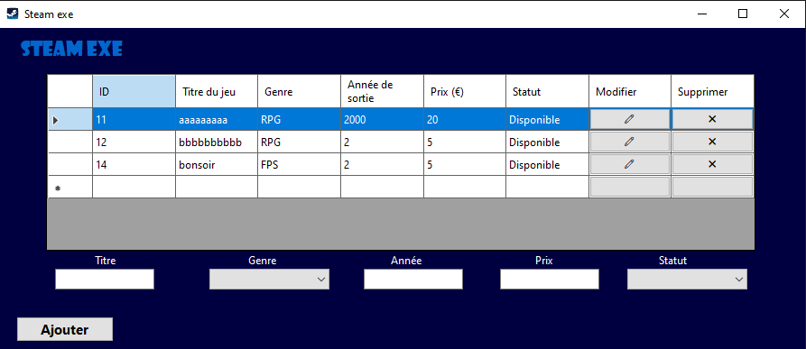
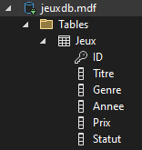

# tpfinalpaul

## Description du projet

Cette application Windows Forms permet de gérer une collection de jeux vidéo. Elle inclut des fonctionnalités telles que l'affichage des jeux dans une DataGridView, l'ajout, la modification et la suppression de jeux, ainsi que la sauvegarde des données dans une base de données locale `.mdf`.

## Fonctionnalités principales

- **Affichage des jeux** dans une DataGridView avec les colonnes suivantes :
  - Titre (Texte)
  - Genre (ComboBox : Action, RPG, Sport, etc.)
  - Année de sortie (Numérique, validation incluse)
  - Prix (Numérique, validation incluse)
  - Statut (Disponible, Prêté, Vendu)
- **Ajout d'un jeu** via un formulaire spécifique
- **Modification d'un jeu** avec vérification et confirmation
- **Suppression d'un jeu** avec confirmation
- **Validation des champs** :
  - L'année et le prix ne peuvent contenir que des chiffres
  - Message d'erreur si une valeur incorrecte est saisie
- **Connexion à une base de données locale** `.mdf` 


## Aperçu



## Installation et exécution

### Prérequis

- Visual Studio 2022
- SQL Server LocalDB (intégré à Visual Studio)
- .NET Framework compatible avec WinForms

### Installation

1. **Cloner le projet**
   ```sh
   git clone (lien_de_la_page_github)
   ```
2. **Ouvrir le projet** dans Visual Studio 2022
3. **Vérifier la connexion à la base de données** (voir ci-dessous)
4. **Exécuter l'application** (`F5` ou `Démarrer` dans Visual Studio)

## Base de données

### Structure

La base de données locale `.mdf` contient une table `Jeux` avec les colonnes suivantes :

| Nom de colonne | Type     | Contraintes                  |
| -------------- | -------- | ---------------------------- |
| ID             | int      | Clé primaire, auto-incrément |
| Titre          | nvarchar | Non NULL                     |
| Genre          | nvarchar | Non NULL                     |
| Année          | int      | Non NULL                     |
| Prix           | decimal  | Non NULL                     |
| Statut         | nvarchar | Non NULL                     |



### Connexion

La connexion à la base de données est définie comme suit dans le projet :

```csharp
string connectionString = "Data Source=(LocalDB)\\MSSQLLocalDB;AttachDbFilename=D:\\vissualstudioprojet\\tpfinalpaul\\tpfinalpaul\\jeuxdb.mdf;Integrated Security=True";
```

Assurez-vous que le fichier `.mdf` est bien attaché dans SQL Server LocalDB


## Auteur

Paul FA


